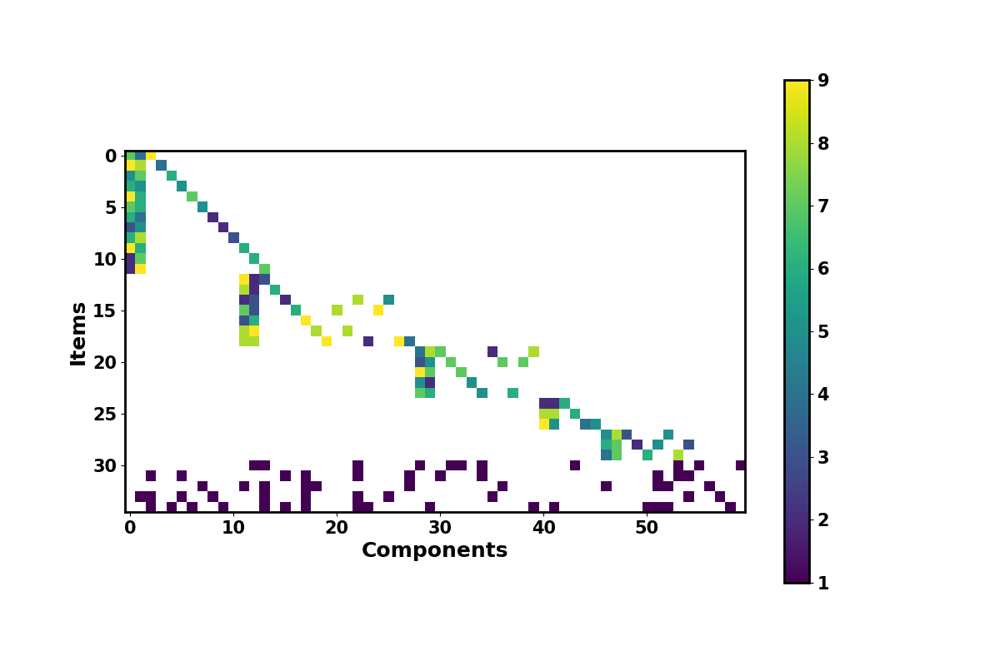

# Assemble To Order Optimization

This library simulates and optimizes **Two-Stage** and **Multi-Stage** policies for *Assemble To Order (ATO)* problems. Specifically, this strategy allows the manufacture of components under demand uncertainty, while assembling end items only after demand is realized.

The code comprises several classes and two main(s) as examples. Those are supported by two different articles that we recommend citing in case you use the library.

## Citing Us

Multi-Stage

```Bibtex
@article{gioia2023On,
	author = {Daniele Giovanni Gioia, Edoardo Fadda and Paolo Brandimarte},
	journal = {International Journal of Production Research},
	publisher={Taylor \& Francis},
	pages = {1-19},
	title = {Rolling horizon policies for multi-stage stochastic assemble-to-order problems},
	volume = {TBA},
  	doi = {https://doi:10.1080/00207543.2023.2283570},
	year = {2023}}

```
A preprint is available on arXiv:2210.00491

#### **PLEASE NOTE THAT IN THIS VERSION OF THE CODE ALL PROBLEMS ARE CONTINUOUS. THE MULTI-STAGE ARTICLE CONSIDERS INTEGER VERSIONS WITH LONGER COMPUTATION TIMES.**

Two-Stage

```Bibtex
@incollection{fadda2023robust,
  year = {2023},
  publisher = {Springer Cham},
  editor = {Cappanera, Paola and Lapucci, Matteo and Schoen, Fabio and Sciandrone, Marco and Tardella, Fabio and Visintin, Filippo},
  series={{AIRO} Springer Series},
  author = {Edoardo Fadda and Daniele Giovanni Gioia and Paolo Brandimarte},
  title = {Risk-averse Approaches for a Two-Stage Assembly-to-Order Problem.},
  booktitle = {Optimization and Decision Science: Operations Research, Inclusion and Equity},
  pages = {147--156},
  isbn = {978-3-031-28863-0},
  doi = {https://doi.org/10.1007/978-3-031-28863-0_13}
}
```

## Code Structure

```bash
|____solver
| |______init__.py
| |____Ato.py
| |____solverGurobi
| | |____atoEV.py
| | |____atoRPMultiStage.py
| | |____atoRP_approx_comp.py
| | |____atoCVaRProfit.py
| | |______init__.py
| | |____atoG.py
| | |____atoG_multi.py
| | |____atoCVaR.py
| | |____atoPI.py
| | |____atoRP.py
| | |____atoRP_multi.py

|____sampler
| |____Hierarchical_Sampl.py
| |______init__.py
| |____MultiStage_Sampl.py
| |____Sampler.py
| |____Gaussian_Sampl.py

|____instances
| |____Instance.py
| |______init__.py
| |____InstanceRandom.py
| |____InstanceRead.py

|____etc
| |____ato_Params.json
| |____instance_Params.json
| |____sampler_Params.json

|____agents
| |____twoStageAgent.py
| |______init__.py
| |____atoAgent.py
| |____multiStageAgent.py
| |____perfectInfoAgent.py

|____utils
| |____Tester.py
| |____utils.py

|____FOSVA
| |____fosva_ato.py
| |____fosva.py
| |______init__.py

|____scenarioReducer
| |____scenario_reducer.py
| |______init__.py
| |____fast_forward_W2.py

|____scenarioTree
| |______init__.py
| |____scenarioTree.py

|____envs
| |____simplePlant.py
| |______init__.py

|____requirements
|____main_multistage.py
|____main_risk_measures.py
|____README.md

```

## Instance generation

Each instance of the ATO problem comprises:

- The available capacity for each machine.
- A set of technological and commercial parameters (costs and prices of components and end items).
- The Gozinto factors (amount of components required for assembling the end item).

In case of a random generation of an instance (by means of the **InstanceRandom** class), all these characteristics of the problems are tuned by the **instance_Params** json file in the _etc_ folder.

Here it follows the role of each available parameter:

- "seed" $\rightarrow$ Initialization of the pseudorandom number generator.
- "n_items" $\rightarrow$ Number of end items.
- "n_components" $\rightarrow$ Number of components.
- "n_machines" $\rightarrow$ Number of machines.
- "profit_margin_{low, medium, high}" $\rightarrow$ Minimum and maximum of the uniform distribution domain employed to generate the margins (thus the price) of the end items.
- "perc_{low,medium}_margin_item" $\rightarrow$  Proportion of the low,medium and consequentially high margin classes of end items.
- "processing_time_interval" $\rightarrow$ Domain of the random variable that generates the required machines capacity.
- "dict_gozinto" $\rightarrow$ Characteristics of the Gozinto matrix, where each family has a fixed number of end items ("n_items_per_family")and, within a family, these items have a number of requested components ("n_components_per_family"), either individual or shared with other members ("n_common_components_per_family"). Moreover, we also introduce degenerate families, composed by one single item and we call them outcast ("n_outcast_items"). They either selects a component in their bill of materials or not with probability ("p_outcast_component").
- "component_cost" $\rightarrow$ Domain of the random variable that generates the cost of the components.
- "tightness" $\rightarrow$ It defines the machine availability w.r.t. the production rquired if the average demand is cosidered. (E.g., 0.8 means that we have enough machine availability to produce 80% of the average demand per per time step).
- "initial_inventory" $\rightarrow$ Initial inventory of the components. Note that the dimension must be equal to "n_components".
- "lost_sales" and "holding_costs" $\rightarrow$ Percentage that defines the lost sales and the holding costs by multiplying the end items price and the components cost.

All the Instance classes inherit a Gozinto matrix print function that associates the number of required components for each end item. We provide an example hereafter:



The instance can also be read from a json file through the **InstanceRead** class.

## Sampler & scenarios

Once an instance of the problem is formulated, the main source of uncertainty, according to our assumption on the ATO problem, is the demand for each end item. Specifically, it is uncertain and possibly subject to seasonality.

The **Sampler** class defines the mandatory methods for the simulation of the demand. Generally speaking, given a number of scenarios, the sampler returns a random demand per end item per scenario, following different sampling methodologies.\
We list the available sampler and their characteristics hereafter.

| Sampler | Characteristics |
| ------------- |:-------------:|
|GaussianSampler |  The Gaussian sampler generates the demand according to **independent** and identically distributed Gaussian random variables with mean ("mu") and standard deviation ("sigma") specificated in "./etc/sampler_Params".
|BiGaussianSampler| The Gaussian sampler is available also in a bi-modal variant, where the additional mean ("mu2"), standard deviation ("sigma2") and mixing factor ("p1") have to be specified.
|HierarchicalSampler| This sampler considers a process composed of two nested steps, such that a family correlation is generated. Firstly, we independently sample the aggregated demand for the entire family, then the overall demand per family is split among the items belonging to the family according to weights randomly sampled from a Dirichlet distribution.
|MultiStageSampler| It adapts the other samplers to a multistage setting. It generates as scenarios a fixed horizon number of sampled demand per end item. It is possible to set seasonality in a multiplicative ("multiplicativeSeas") or additive ("additiveSeas") way w.r.t. the mean and standard deviation of the employed distribution.

When dealing with a fixed large number of scenarios, e.g., from a data-driven approach, it is possible to reduce them with the **scenarioReducer** classes. This class implements a scenario reducer that follows a Fast Forward (FF) technique with a 2-norm metric.\
It is automatically implemented in the branching process of the scenario tree building for the **atoRPMultiStage** solver, where the branching factor leads the number of scenarios to optimize and retain.

## Solver

Several classes are available. They solve different problems in terms of both objective functions and constraints. However, all of them currently rely on [**Gurobi**](https://www.gurobi.com/). Extensions with other software are possible.\
Ato.py summarizes what a generic solver/problem should contain in its methods.\
AtoG.py works as an interface (super-class) of the assembly-to-order solvers in Gurobi. Here the population (Gurobi model construction) and the solution process (that can rely on different algorithms) are separated. AtoG_multi.py works as an interface for multi-stage problems where a rolling-horizon logic requires a different methodology of access to the variables.

Here it follows a table summing up the principal characteristics of the available solvers. All of them but atoEV and atoRPMultiStage are Two-stage environments, the latter works with several kinds of scenario trees. The classes inherit from either AtoG.py or AtoG_multi.py, defining how to populate the model thanks to polymorphism.

🔴  **For a detailed formulation of the available models please refer to the cited papers.** 🔴

| Solver | Characteristics |
| ------------- |:-------------:|
| atoCVaR  | It minimizes the $$\text{CVaR}_{\alpha}$$ following the $\alpha$ = **CVaR_alpha** selected in './etc/ato_Params', while providing a minimum expected net profit according to the **CVaR_expected_profit**.
| atoCVaRProfit   | It maximizes the expected net profit while bounding the $$\text{CVaR}_{\alpha} $$ according to the **atoProfitCVaR_limit** value in './etc/ato_Params' with an $\alpha$ level of *atoProfitCVaR_alpha*.
| atoEV  | It maximizes the expected net profit of the problem without a recourse function, thus operating in one single stage with averaged constraints.
| atoPI  | In this version of the ATO problem, we assume we have Perfect Information (PI) of the demand in a **multi-stage** setting, thus producing optimally. This allows the calculation of the EVPI (Expected Value of Perfect Information).
| atoRP  | Standard Two-Stage stochastic LP model with recourse of the ATO problem, treated with the well-konwn Sampling Average Approximation (SAA).
| atoRP_multi  | Standard Two-Stage stochastic LP model with recourse of the ATO problem from a rolling-horizon point of view, with holding costs and lost sales, treated with the well-known Sampling Average Approximation (SAA).
| atoRPMultiStage  | This model represents the demand uncertainty by means of a scenario tree with personalizable length and branching factors through the **branching_factors** vector in './etc/ato_Params'. It supports seasonality throughout the scenario and can rely on multiple nodes per time-steps as well as average approximations. An extended discussion of the model is presented in our paper "**Rolling horizon policies for multi-stage stochastic assemble-to-order problems**".
| atoRP_approx_comp  | This class contains two sub-classes made for generating and applying two-stage models with an end-of-horizon value function on multi-stage settings. On the one hand, **AtoRP_approx_comp_v** serves to approximate the value of the initial inventory according to a first-order analysis in a Two-Stage setting. On the other hand, **AtoRP_approx_comp** applies the approximate value of the inventory following a linear piecewise value function defined by its breakpoints and slopes.

## FOSVA

The FOSVA package contains the functions needed to apply the *First Order Stock Value Approximation* (FOSVA). The available functions are divided in two sets: the ones related to the general approach and the ones related to the approach customized for the ATO problem. The function in the former set
| Function           | Description                                                  |
| ------------------ | ------------------------------------------------------------ |
| piecewise_function | It is a function to define piecewise linear function more user-friendly than [numpy.piecewise](https://numpy.org/doc/stable/reference/generated/numpy.piecewise.html). It is thought to become a lambda function after the specification of breakpoints (argument *breaks*) and slopes (argument *slope*). |
| fosva              | It runs the fosva algorithm for one-dimensional problem. It can be used for problems with one inventory or to test the results on simple functions. |
| multi_fosva        | It runs the fosva algorithm for multi-dimensional problems.   |

Moreover, in this last set there are the functions: update_nu and _run_fosva_iteration which  arrange the dimension of the vector of slopes (*nu*) and run  one iteration of the fosva algorithm, respectively.
Instead, the function in the latter set are

| Function           | Description                                                  |
| ------------------ | ------------------------------------------------------------ |
| compute_gradient   | It computes the values of the TS to compute the left and right slopes. |
| run_multifosva_ato | It implements the FOSVA algorithm for the ATO problem. Basically, it defines the way to compute the gradient and to generate random points that will be used by the general FOSVA algorithm. |

Please, notice that by adapting these two functions it is possible to apply FOSVA to other problems.


## Agents & Envs

When dealing with a multistage environment, we consider a sequential approach based on the [Gym](https://www.gymlibrary.dev/) framework.

An **atoAgent** is responsible for the communication between the dynamics of the problem and the sequential optimization. Specifically, both **twoStageAgent** and **multiStageAgent** decide an action (a production schedule) for each specific time step, following the information about the current state of the system provided by a class of the *envs* family (e.g., **simplePlant**). We refer to the [Gym](https://www.gymlibrary.dev/) documentation for a deeper analysis of the observation/action/step sequentiality.\
Focusing on the agents, intuitively, the **twoStageAgent** is made to deal with the Two-Stage solvers, while **multiStageAgent** allows only for the AtoRPMultiStage class, making an explicit model for the seasonality possible.
The **perfectInfoAgent** decides all actions in a horizon at the first instant of time, taking into account the already known demand.
